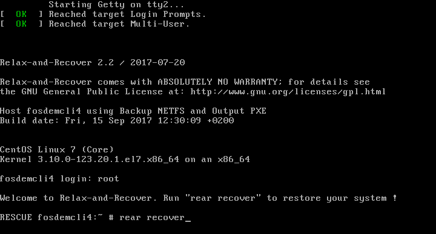
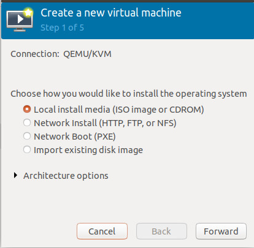
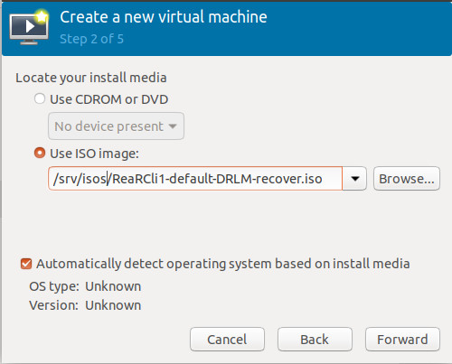
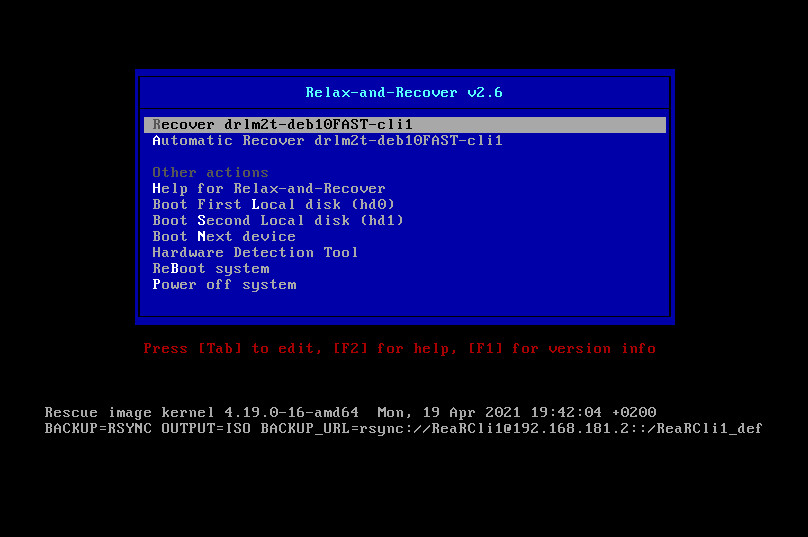
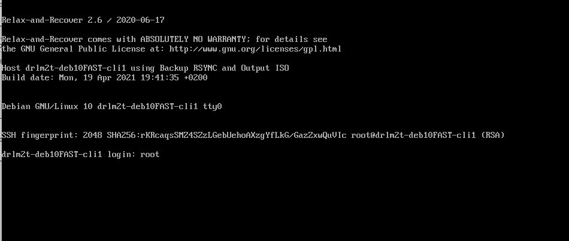
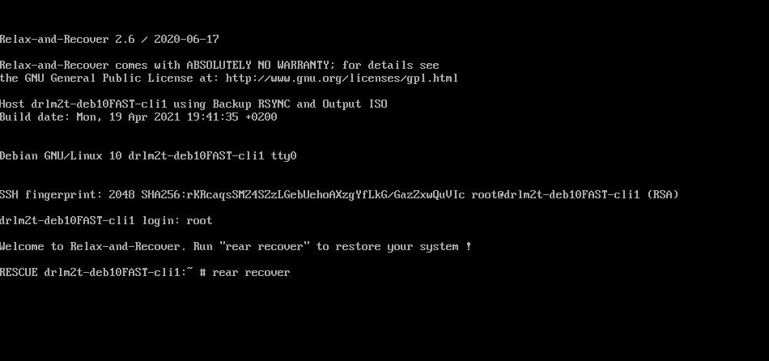
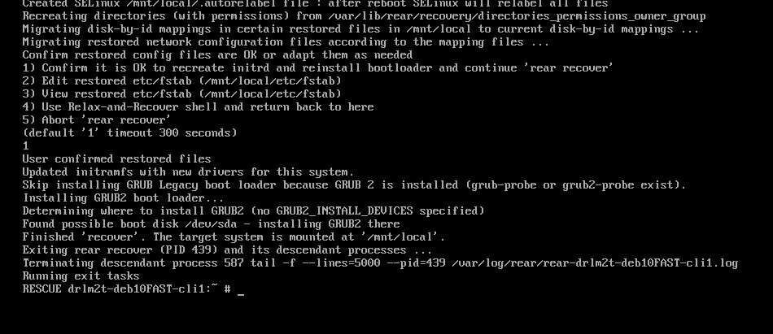

DRLM Client Recover
===================

In this section we show how to recover a system which has been backed up.

PXE Client Recover
~~~~~~~~~~~~~~~~~~

In this example your client and server has the following configuration. Content of client configuration file /etc/drlm/clients/fosdemcli4.cfg 

.. code-block:: console

  DRLM_BKP_TYPE="PXE"
  DRLM_BKP_PROT="NETFS"
  DRLM_BKP_PROG="TAR"

Reboot the Client and select boot from network. Automaticaly will boot from PXE.

1. The DRLM server gives us through PXE/TFTP the client boot system. We just have to select first menu option to enter in the recovery system.

.. image:: ../images/RecoverImage1_v2.png
      :width: 640px
      :height: 480px

2. Once we have the system ready Login as "root". No password required.

.. image:: ../images/RecoverImage2.jpg
      :width: 640px
      :height: 480px

3. Now we can recover the system with the command "rear recover".

4. The system is recovering.

.. image:: ../images/RecoverImage4.jpg
      :width: 640px
      :height: 480px

5. System recovered! So we only have to restart the client.

.. image:: ../images/RecoverImage5.jpg
      :width: 640px
      :height: 480px

ISO Client Recover
~~~~~~~~~~~~~~~~~~

In this example your client and server has the following configuration. Content of client configuration file /etc/drlm/clients/ReaRCli1.cfg 

.. code-block:: console

  DRLM_BKP_TYPE="ISO"
  DRLM_BKP_PROT="RSYNC"
  DRLM_BKP_PROG="RSYNC"

1. If an ISO type rescue image has been done we can get it from DRLM stord directory (/var/lib/drlm/store/ClientName/ConfigName/*.iso):

.. code-block:: console

  ~# ls /var/lib/drlm/store/ReaRCli1/default/*.iso
  /var/lib/drlm/store/ReaRCli1/default/ReaRCli1-default-DRLM-recover.iso

And use this image to create a new machine from ISO:

2. When Relax-and-Revocer menu appear, we just have to select first menu option to enter in the recovery system.

3. Once we have the system ready Login as “root”. No password required.

4. Now we can recover the system with the command “rear recover”. 

5. System recovered! So we only have to restart the client.

