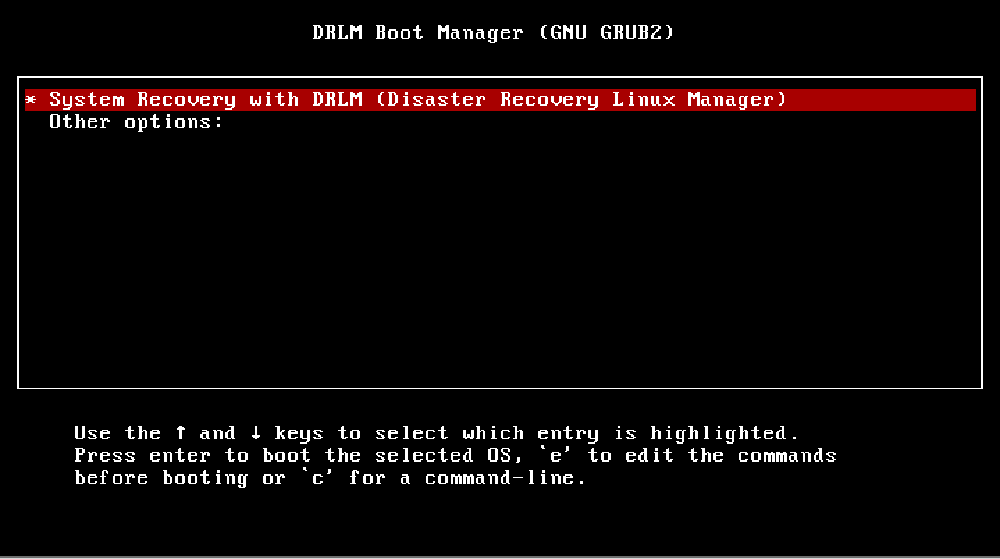
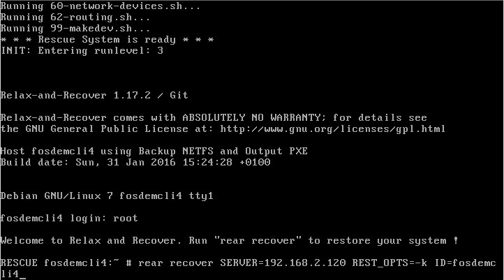
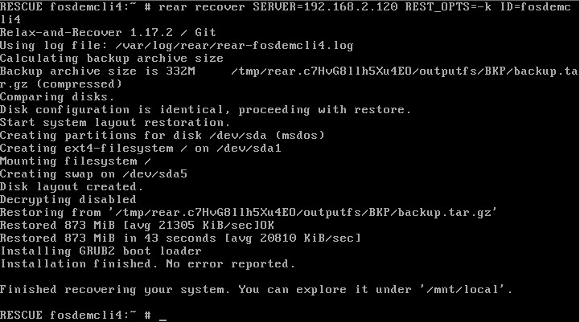

DRLM Client Recover
===================

In this section we show how to recover a system which has been backed up.

In this example your client and server has the following configuration. You have to adapt it to your case.

::

	DRLM Server Host Name: DRLMsrv 
	DRLM Server IP: 192.168.2.120

	ReaR Client Host Name: fosdemcli4 
	ReaR Client IP: 192.168.2.102

Step by Step Client Recover
~~~~~~~~~~~~~~~~~~~~~~~~~~~

Reboot the Client and select boot from network. Automaticaly will boot from PXE.

The DRLM server gives us through PXE/TFTP the client boot system. We just have to type "rear" to start the recovery system.

Once we have the system ready Login as "root". No password required.

.. image:: ../images/RecoverImage2.jpg

We indicate that we want to recover the system with the command "rear recover" and the following variables SERVER="DRLM Server Ip" REST_OPTS=-k ID="Rear Client Host Name", in our case "rear recover SERVER=192.168.2.120 REST_OPTS=-k ID=fosdemcli4"

The system is recovering.

.. image:: ../images/RecoverImage4.jpg

System recovered! So we only have to restart the client.

