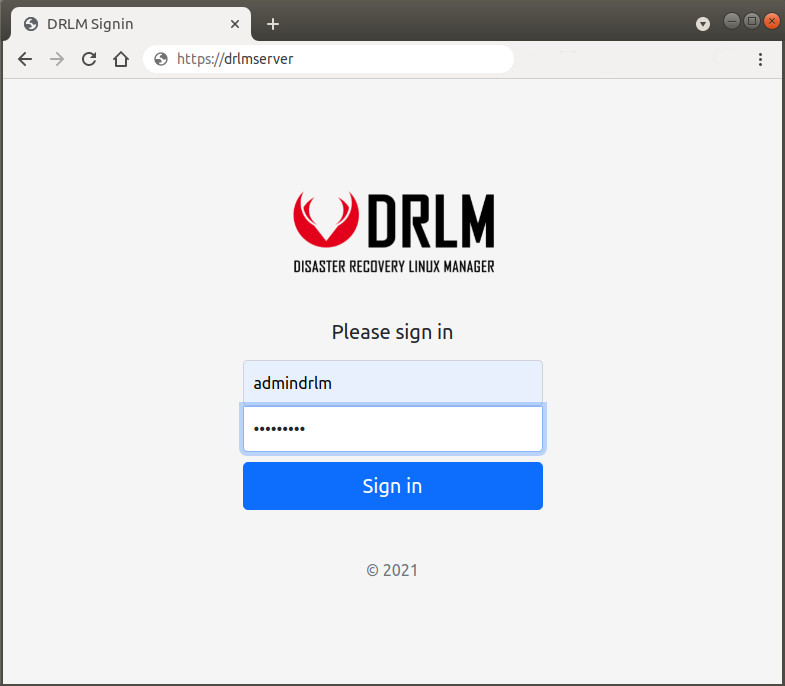
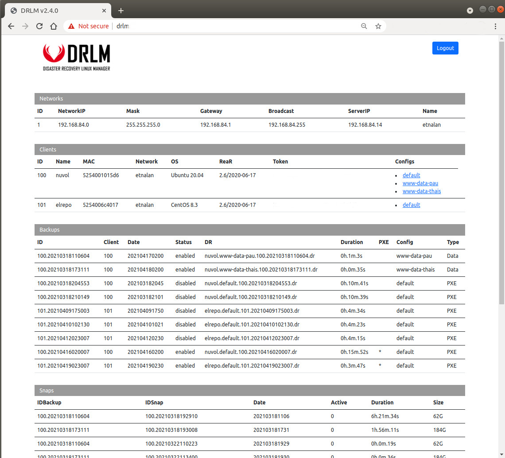
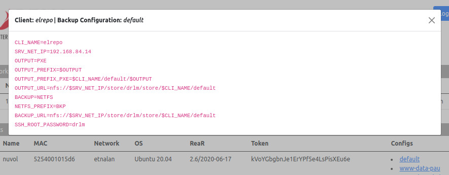

DRLM API
========

.. warning::

  DRLM API is under construction

DRLM API handles client configuration requests and client runbackup logs.

Once DRLM has been installated is possible to acces at his DRLM API frontend to view database information and client Configurations.

.. code-block:: bash

  URL: https://drlm_server_ip
  default user: admindrlm
  default pass: admindrlm

Defautl password can be modified at /etc/drlm/local.conf with API_PASSWD="newpasswd"

Signin page
~~~~~~~~~~~

General view
~~~~~~~~~~~~

Client configuration
~~~~~~~~~~~~~~~~~~~~

Management
~~~~~~~~~~

Start DRLM API

.. code-block:: console
 
  ~# systemctl start drlm-api.service

Restart DRLM API

.. code-block:: console

  ~# systemctl restart drlm-api.service

Stop DRLM API

.. code-block:: console

  ~# systemctl stop drlm-api.service

Log File
~~~~~~~~

The log file for DRLM API can be found at /var/log/drlm/drlm-api.log

example:

.. code-block:: console

  root@drlmsrv:~# cat /var/log/drlm/drlm-api.log 
  2022/03/02 13:41:00 configuration.go:181: ==============================
  2022/03/02 13:41:00 configuration.go:182: === DRLM API CONFIGURATION ===
  2022/03/02 13:41:00 configuration.go:183: ==============================
  2022/03/02 13:41:00 configuration.go:184: VAR_DIR=/var/lib/drlm
  2022/03/02 13:41:00 configuration.go:185: STORDIR=/var/lib/drlm/store
  2022/03/02 13:41:00 configuration.go:186: DB_PATH=/var/lib/drlm/drlm.sqlite
  2022/03/02 13:41:00 configuration.go:187: CLI_CONF_DIR=/etc/drlm/clients
  2022/03/02 13:41:00 configuration.go:188: REAR_LOG_DIR=/var/log/drlm/rear
  2022/03/02 13:41:00 configuration.go:189: DRLM_CERT=/etc/drlm/cert/drlm.crt
  2022/03/02 13:41:00 configuration.go:190: DRLM_KEY=/etc/drlm/cert/drlm.key
  2022/03/02 13:43:10 drlm-api.go:82: 192.168.123.41:52502 GET /clients/drlmcli1/config
  2022/03/02 13:43:10 drlm-api.go:82: 192.168.123.41:52504 PUT /clients/drlmcli1/log/mkbackup/20220302134310
  2022/03/02 13:44:46 drlm-api.go:82: 192.168.123.159:33608 GET /clients/drlmcli2/config
  2022/03/02 13:44:46 drlm-api.go:82: 192.168.123.159:33610 PUT /clients/drlmcli2/log/mkbackup/20220302134446
  2022/03/02 13:46:09 drlm-api.go:82: 192.168.123.159:33792 GET /clients/drlmcli2/config
  2022/03/02 13:46:09 drlm-api.go:82: 192.168.123.159:33794 PUT /clients/drlmcli2/log/mkbackup/20220302134609
  2022/03/02 13:51:37 drlm-api.go:82: 192.168.123.41:52522 GET /clients/drlmcli1/config
  2022/03/02 13:51:37 drlm-api.go:82: 192.168.123.41:52524 PUT /clients/drlmcli1/log/mkbackup/20220302135137
  2022/03/02 13:54:50 drlm-api.go:82: 192.168.123.159:34854 GET /clients/drlmcli2/config
  2022/03/02 13:54:50 drlm-api.go:82: 192.168.123.159:34856 PUT /clients/drlmcli2/log/mkbackup/20220302135450
  2022/03/02 14:01:16 drlm-api.go:82: 192.168.123.159:35642 GET /clients/drlmcli2/config
  2022/03/02 14:01:16 drlm-api.go:82: 192.168.123.159:35644 PUT /clients/drlmcli2/log/mkbackup/20220302140116
  2022/03/02 14:09:43 drlm-api.go:82: 192.168.123.159:36674 GET /clients/drlmcli2/config
  2022/03/02 14:09:43 drlm-api.go:82: 192.168.123.159:36676 PUT /clients/drlmcli2/log/mkbackup/20220302140943
  2022/03/02 14:13:07 drlm-api.go:82: 192.168.123.41:52540 GET /clients/drlmcli1/config
  2022/03/02 14:13:07 drlm-api.go:82: 192.168.123.41:52542 PUT /clients/drlmcli1/log/mkbackup/20220302141307
  2022/03/02 14:13:17 drlm-api.go:82: 192.168.123.159:37120 GET /clients/drlmcli2/config
  2022/03/02 14:13:17 drlm-api.go:82: 192.168.123.159:37122 PUT /clients/drlmcli2/log/mkbackup/20220302141317
  ...
  ...
  ...  
