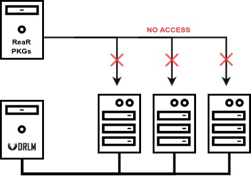
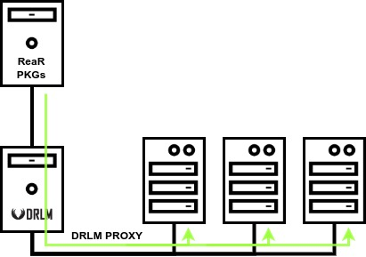

DRLM PROXY
==========

Installing clients in offline environments can be a daunting task, as clients do not have access to download ReaR package and it should be done by hand, without the "drlm instclient" command.

With DRLM PROXY a DRLM server, with acces to the ReaR packages repositories, can act as an intermediate, get the requestet ReaR package and serve it to the client.

To enable DRLM PROXY you must specify where DRLM Server can get the ReaR packets from with the DRLM_PROXY_URL variable and where DRLM clients can get packets at URL_REAR_BASE.

.. code-block:: bash

  #/etc/drlm/local.conf
  ...
  ...
  ...
  ############### ----- DRLM PACKAGE PROXY
  DRLM_PROXY_URL=http://download.opensuse.org/repositories/Archiving:/Backup:
  URL_REAR_BASE="http://drlmServerHostname"
  ########

Once DRLM PROXY is configured just restart the service

.. code-block:: bash

  ~# systemctl restart drlm-proxy.service